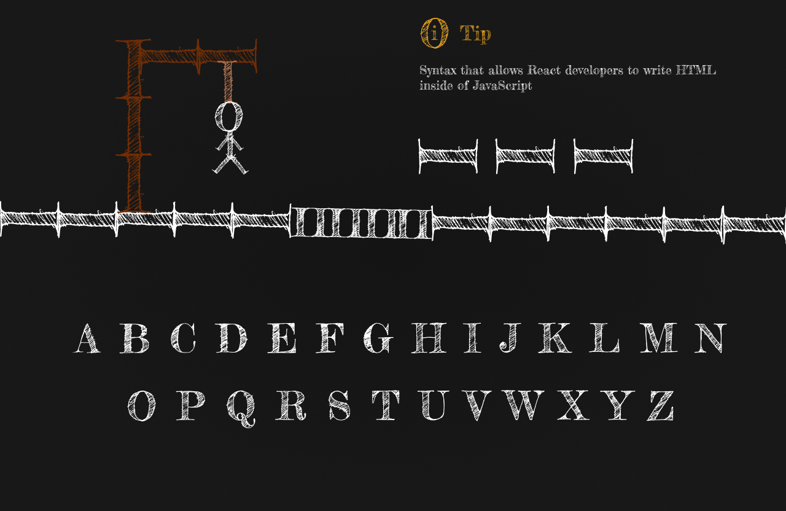
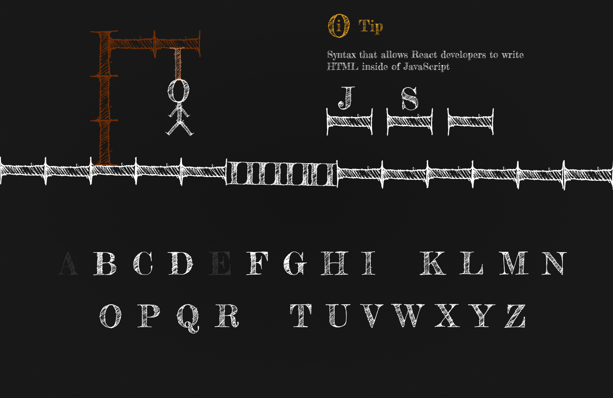
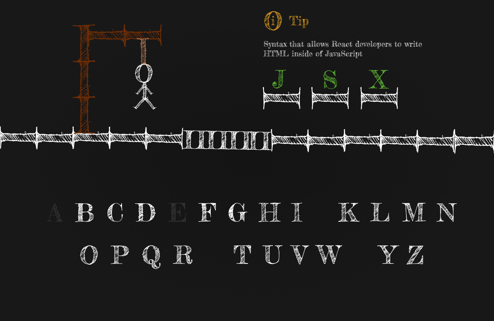
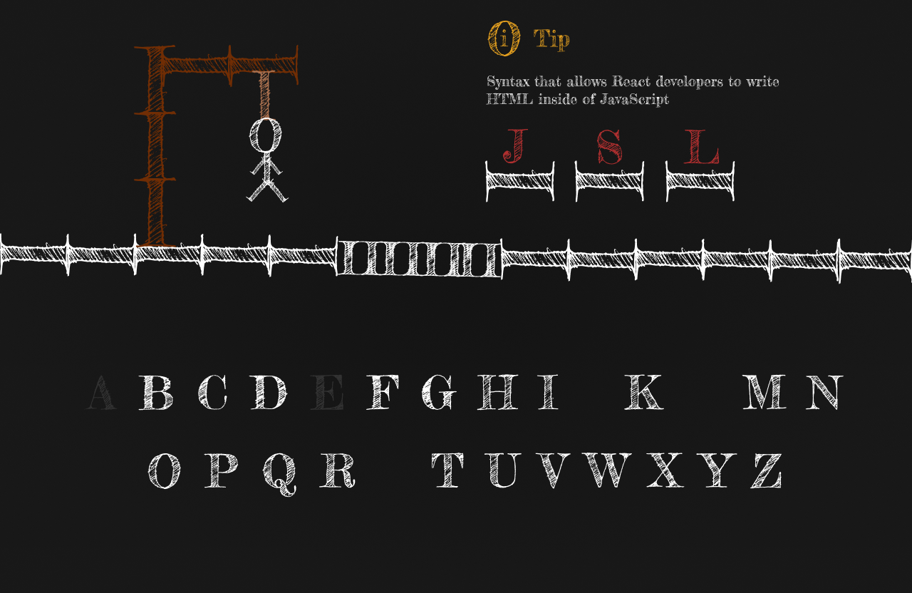
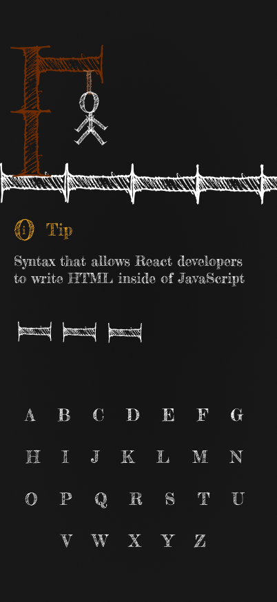
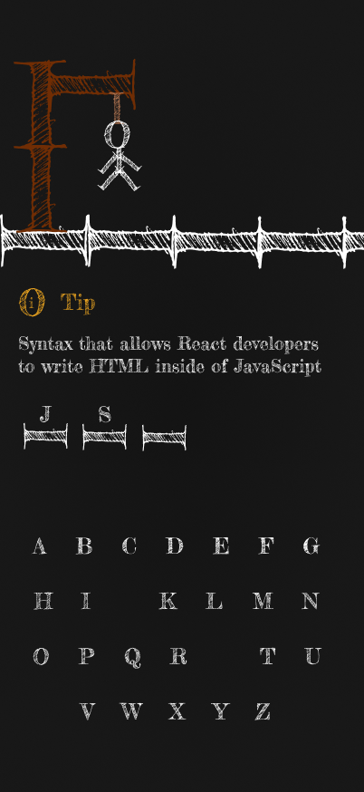
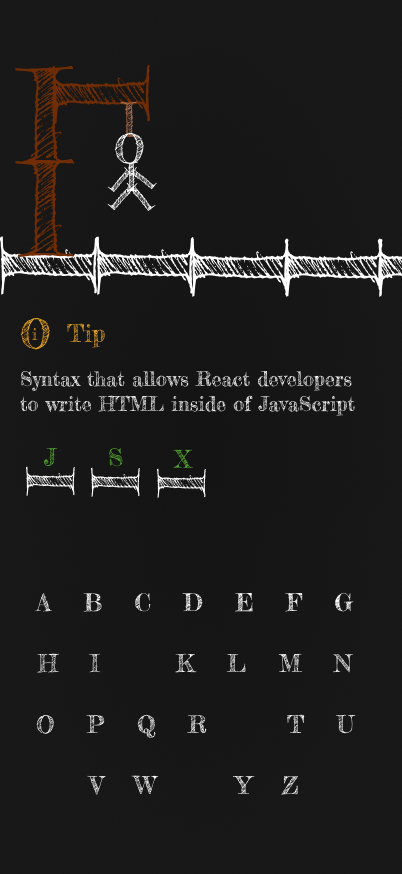
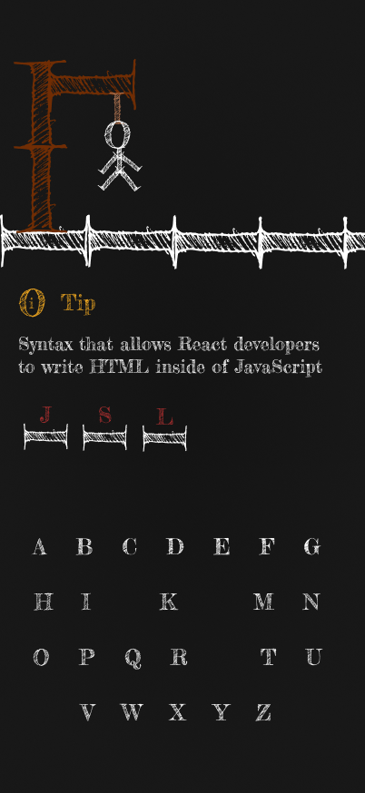

# Hangman Game

A fun word-guessing game where players try to guess a hidden word by suggesting letters. Each incorrect guess brings the hangman closer to completion

## Under Development

This project is currently under development.

## UI Overview

Here are the UI for both desktop and mobile, created using Figma.

### Desktop

### Mobile

